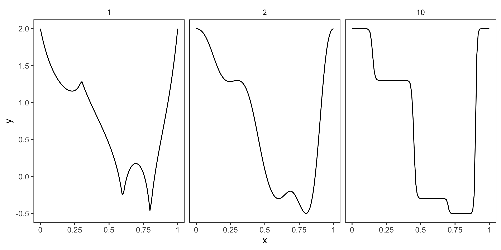

# idw

A JavaScript package for flexible inverse distance weighting (IDW) in any number of dimensions.

## Installation
The module is available on npm:

```
npm install idw
```

## Example of use

### One-dimensional data:
In the one-dimensional case, the positions are specified as an array of numbers:
``` js
const data = {
    positions: [0, 0.3, 0.6, 0.8, 1],
    values: [2, 1.3, -0.3, -0.5, 0]
}

const idw = new IDW(data);

// Interpolate at 100 regularly spaced positions between 0 and 1
const x = Array(100).fill().map((_, i) => i / 99);
const v = x.map(p => idw.evaluate(p, 2));
console.log(v);
```
The second parameter in `idw.evaluate` is the power used when computing the weights.
Here's a comparison using the setup above, with the value of the power above each plot:



### Two-dimensional data
Now, the positions are represented as an array of arrays:
``` js
const data = {
    positions: [
        [0.1, 0.3],
        [0.6, 0],
        [0.2, 0.8],
        [1, 0]
    ],
    values: [0, 0.33, 0.67, 1]
}

const idw = new IDW(data);

// Interpolate at 100 random positions
const x = Array(100).fill().map(() => [Math.random(), Math.random()]);
const v = x.map(p => idw.evaluate(p, 2));
console.log(v);
```

## Theory

Inverse distance weighting is a method for 

## API

### Constructor

**new IDW(data[, options])**

- *data :*
  - *positions :* The positions of the interpolation data. In the one-dimensional case, this is an array of numbers ([x_1, x_2,...,x_n]). Otherwise, it's an an array of arrays ([[x_1, y_1,...], [x_2, y_2,...], ...]).
  - *values :* An array of values, corresponding to the elements in `positions`.
- *options :*
  - *innerDistFunction :* The "inner distance function" used when computing the distance between two positions, see above.
  - *outerDistFunction :* The "outer distance function" used when computing the distance between two positions, see above.
  - *weightFunction :* Function that transforms the values of the weights before computing the weighted average. Expected input is a number between 0 and 1.
  - *denominatorOffset :* Number that is added to the denominator when computing the weights. Defaults to 0.

``` js
const idw = new IDW({
    positions: [0, 0.25, 0.5, 0.75, 1],
    data: [0.1, 0.2, 0.3, 0.4, 0.5]
});
```

``` js
const idw = new IDW({
    positions: [
        [],
        [],
        [],
    ],
    data: [0.1, 0.2, 0.3, 0.4, 0.5]
});
```