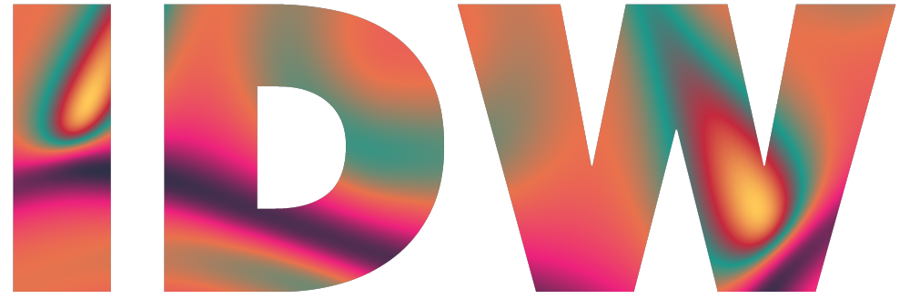
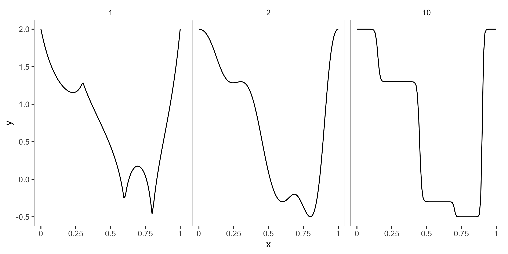
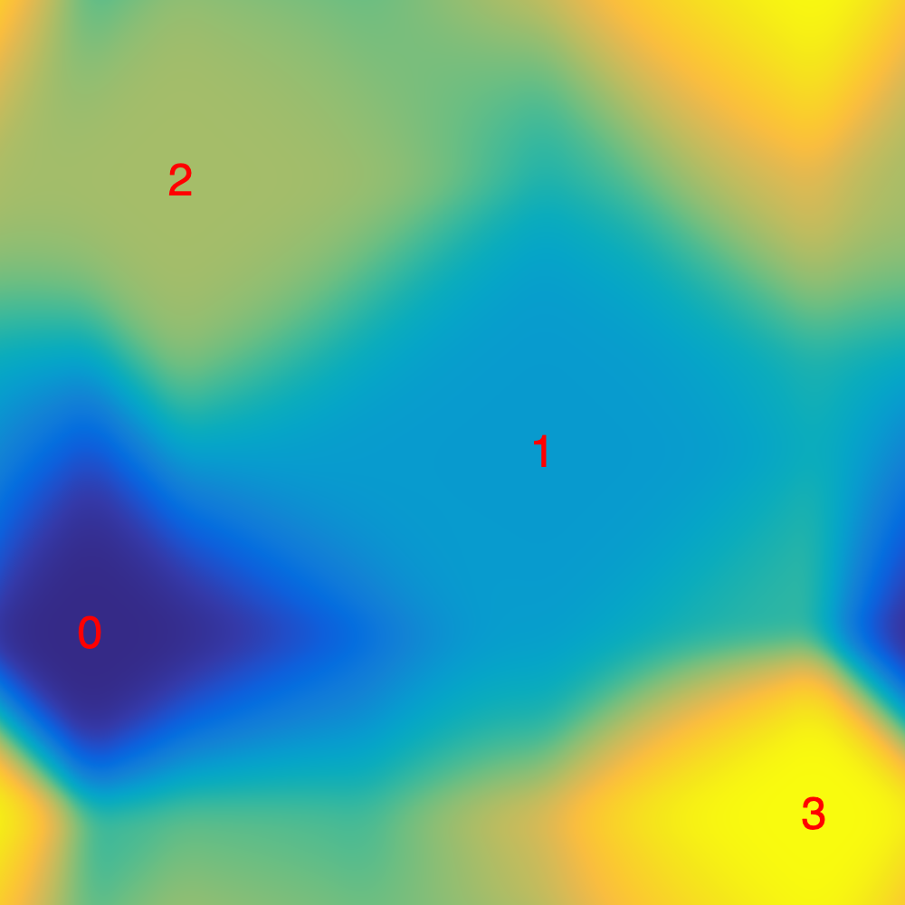
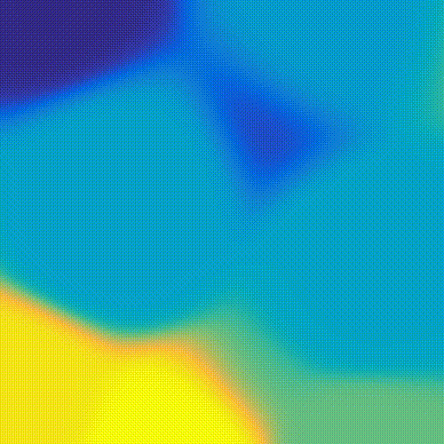

# </img>

idw is a JavaScript package for flexible interpolation of any-dimensional data using inverse distance weighting (IDW).
It includes functionality for generating tileable noise functions.

## Installation
The module is available on npm:

```
npm install idw
```

## Example of use

### One-dimensional data:
In the one-dimensional case, the positions are specified as an array of numbers:
``` js
const idw = new IDW({
    positions: [0, 0.3, 0.6, 0.8, 1],
    values: [2, 1.3, -0.3, -0.5, 2]
});

// Interpolate at 100 regularly spaced positions between 0 and 1
const x = Array(100).fill().map((_, i) => i / 99);
const values = x.map(p => idw.evaluate(p, 2));
console.log(values); // Outputs array of 100 values [v1, v2,...]
```
The second parameter in `idw.evaluate` is the power used when computing the weights.
Here's a comparison using the setup above, with the value of the power above each plot:
<p align="center">
    </img>
</p>


### Two-dimensional data
Now, the positions are represented as an array of arrays:
``` js
const data = {
    positions: [
        [0.1, 0.3],
        [0.6, 0.5],
        [0.2, 0.8],
        [0.9, 0.1]
    ],
    values: [0, 0.33, 0.67, 1]
}
```
Using the data above, we set up an IDW with tileable edges in the square [0, 1] × [0, 1].
It measures distance using the [Manhattan/taxicab distance](https://en.wikipedia.org/wiki/Taxicab_geometry).
``` js
const options = { 
    periodicExtent: [[0, 1], [0, 1]] 
}
const idw = new IDW(data, options);
idw.useTaxicabDistance();

// Interpolate at 100 random positions
const positions = Array(100).fill().map(() => [Math.random(), Math.random()]);
const values = positions.map(p => idw.evaluate(p, 3));
console.log(values); // Outputs array of values [v1, v2,...]
```
Here's how the function looks on a 1000 × 1000 grid over [0, 1] × [0, 1], with the positions indicated by their index in red:
<p align="center">
    </img>
</p>


### Three-dimensional data
For the three-dimensional example, we'll use the `generateNoiseIDW` function to generate an `IDW` object with 40 random positions and values.
The positions are sampled from the cuboid [-1, 1] × [-1, 1] × [0, 1], and the function is tileable/periodic along the z-dimension.
The RNG is specified using a seed value of 1.

``` js
let idw = generateNoiseIDW({
        n: 40, 
        dimensions: 3, 
        extent: [[-1, 1], [-1, 1], [0, 1]], 
        periodic: [false, false, true]
}, 1);

// Interpolate at 100 random positions inside [-1, 1] × [-1, 1] × [0, 1]
const positions = Array(100).fill().map(() => [-1 + 2*Math.random(), -1 + 2*Math.random(), Math.random()]);
const values = positions.map(p => idw.evaluate(p, 3));
console.log(values); // Outputs array of values [v1, v2,...]
```

The animation below shows the noise function as the z-coordinate increases from 0 to 1.
Since the function is periodic along the z-dimension, it leads to a perfect loop!

<p align="center">
    <a href="https://gfycat.com/piercingbleakeskimodog">
        </img>
    </a>
</p>

## Theory

**Link to blog post**

## API

### Constructor

**new IDW(data[, options])**

- *data :*
  - *positions :* The positions of the interpolation data. In the one-dimensional case, this is an array of numbers ([x_1, x_2,...,x_n]). Otherwise, it's an an array of arrays ([[x_1, y_1,...], [x_2, y_2,...], ...]).
  - *values :* An array of values, corresponding to the elements in `positions`.
- *options :*
  - *innerDistFunction :* The "inner distance function" used when computing the distance between two positions, see above.
  - *outerDistFunction :* The "outer distance function" used when computing the distance between two positions, see above.
  - *weightFunction :* Function that transforms the values of the weights before computing the weighted average. Expected input is a number between 0 and 1.
  - *denominatorOffset :* Number that is added to the denominator when computing the weights. Defaults to 0.

``` js
const idw = new IDW({
    positions: [0, 0.25, 0.5, 0.75, 1],
    data: [0.1, 0.2, 0.3, 0.4, 0.5]
});
```

``` js
const idw = new IDW({
    positions: [
        [],
        [],
        [],
    ],
    data: [0.1, 0.2, 0.3, 0.4, 0.5]
});
```