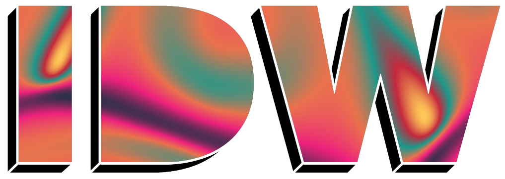
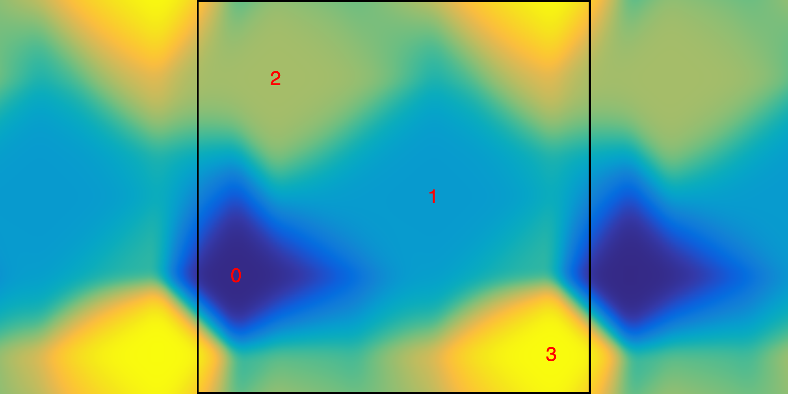

# </img>

idw is a JavaScript package for flexible interpolation of any-dimensional data using [inverse distance weighting (IDW)](https://en.wikipedia.org/wiki/Inverse_distance_weighting).
It includes functionality for generating tileable noise functions.

## Installation
The module is available on npm:

```
npm install idw
```

## How (nearly) everything works

Inverse distance weighting is a method for interpolating data consisting of pairs of positions and values.
It interpolates by computing a weighted average of the supplied values, placing a higher amount of weight on those near the position of interest.

Consider, for example, the data consisting of two-dimensional positions `p₁ = [0, 0]` and `p₂ = [1, 1]` with corresponding values `v₁ = 0` and `v₂ = 1`, and let `p = [0.25, 0.4]` be the position that we want to interpolate.
The distances are `d₁ = distance(p, p1) = √((0 - 0.25)² + (0 - 0.4)²) = 0.472` and `d₂ = distance(p, p2) = 0.960`, leading to weights `w₁ = 1 / d₁ = 2.112` and `w₂ = 1 / d₂ = 1.041`.
The interpolated value is then the weighted average `v = (w₁*v₁ + w₂*v₂) / (w₁ + w₂) = 0.330`.

### The power parameter
In practice, the weights are usually computed as `w = 1 / d^p`, where the parameter `p` is a positive number.
The [first example below](#one-dimensional-function) compares 1D interpolation with different values for `p`, and gives some useful intuition.
Using a small value leads to a function that has spikes at the data positions.
As it increases, the function becomes smoother, and eventually flattens out to nearest-neighbor interpolation.
In `idw`, the parameter `p` is specified in the `evaluate` method (see the [API description](#api)).

### Predefined distance functions

The example above measures the distance using the [Euclidean distance](https://en.wikipedia.org/wiki/Euclidean_distance) (i.e. the length of the straight line connecting the positions): 

&nbsp;&nbsp;&nbsp;&nbsp;&nbsp;&nbsp;&nbsp;&nbsp;&nbsp;`distance([x₁, y₁,...], [x₂, y₂,...]) = √((x₂ - x₁)² + (y₂ - y₁)² + ...)`

where `...` indicates additional coordinates in three or more dimensions.
In addition to this, `idw` offers three predefined distance functions:

[Taxicab/Manhattan distance](https://en.wikipedia.org/wiki/Taxicab_geometry) (`useTaxicabDistance()`):

&nbsp;&nbsp;&nbsp;&nbsp;&nbsp;&nbsp;&nbsp;&nbsp;&nbsp;`distance([x₁, y₁,...], [x₂, y₂,...]) = |x₂ - x₁| + |y₂ - y₁| + ...`

[Chebyshev/chessboard distance](https://en.wikipedia.org/wiki/Chebyshev_distance) (`useChessboardDistance()`):

&nbsp;&nbsp;&nbsp;&nbsp;&nbsp;&nbsp;&nbsp;&nbsp;&nbsp;`distance([x₁, y₁,...], [x₂, y₂,...]) = max(|x₂ - x₁|, |y₂ - y₁|,...)`

[Minkowski distance](https://en.wikipedia.org/wiki/Minkowski_distance) (`useMinkowskiDistance(p)`):

&nbsp;&nbsp;&nbsp;&nbsp;&nbsp;&nbsp;&nbsp;&nbsp;&nbsp;`distance([x₁, y₁,...], [x₂, y₂,...]) = ((x₂ - x₁)ᵖ + (y₂ - y₁)ᵖ + ...)¹ᐟᵖ`

Euclidean distance is the default.

### Custom distance functions

`idw` also allows the user to define their own distance functions.
To understand how this works, first notice that each of the distance function above can be expressed as

&nbsp;&nbsp;&nbsp;&nbsp;&nbsp;&nbsp;&nbsp;&nbsp;&nbsp;`distance([x₁, y₁,...], [x₂, y₂,...]) = outerDistFunction([innerDistFunction(x2 - x1), innerDistFunction(y2 - y1),...])`.

Euclidean distance, for example, is

&nbsp;&nbsp;&nbsp;&nbsp;&nbsp;&nbsp;&nbsp;&nbsp;&nbsp;`innerDistFunction = d => d*d`

&nbsp;&nbsp;&nbsp;&nbsp;&nbsp;&nbsp;&nbsp;&nbsp;&nbsp;`outerDistFunction = arr => Math.sqrt(IDW.sum(arr))`

where the function `IDW.sum` takes in an array and computes the sum of its elements.

Specifying custom values for `innerDistFunction` and `outerDistFunction` can lead to very interesting and unpredictable results.


### Tileable functions
The optional parameter `periodicExtent` can be used to create tileable interpolation functions.
The image below demonstrates the situation where `periodicExtent = [[0, 2], [0, 1]]`.

<p align="center">
    </img>
</p>

In this case, the rectangle "wraps around", so that the opposite edges are connected, or "glued together".
To better understand how this affects the function, let's compute the distance between the cyan (`[0.2, 0.1]`) and pink (`[1.8, 0.8]`) points.
As always, there's the length of the straight line connecting the points, indicated by a solid blue line.
Its length is `√((1.8 - 0.2)² + (0.8 - 0.1)²) = 1.75`.
However, there's a second straight path connecting the points: moving along the solid brown line, which first crosses the right edge over to the left side, and then from the top to the bottom.
The distance travelled along this path is `√((0.2 + 0.2)² + (0.2 + 0.1)²) = 0.5`, which is also the distance between the points.

When a function has a `periodicExtent` specified, it becomes tileable, meaning that it repeats smoothly across the boundaries.
The [two-dimensional example](#two-dimensional-function) demonstrates this.
Note: It's possible to create functions that are tileable along some boundaries, but not others (see the [API documentation](#api)).

When tileable interpolation functions are evaluated outside `periodicExtent`, the value at the equivalent position inside `periodicExtent` is returned.
In the example above, the position `[2.1, 1.2]` is equivalent to `[0.1, 0.2]`.

### Weight function

The `weightFunction` parameter gives the user another way to modify the behavior of the interpolation function.


## Examples of use

### One-dimensional function:
In the one-dimensional case, the positions are specified as an array of numbers:
``` js
const idw = new IDW({
    positions: [0, 0.3, 0.6, 0.8, 1],
    values: [2, 1.3, -0.3, -0.5, 2]
});

// Interpolate at 100 regularly spaced positions between 0 and 1
const x = Array(100).fill().map((_, i) => i / 99);
const values = x.map(p => idw.evaluate(p, 2));
console.log(values); // Outputs array of 100 values [v1, v2,...]
```
The second parameter in `idw.evaluate` is the power used when computing the weights.
Here's a comparison using the setup above, with the value of the power above each plot:
<p align="center">
    </img>
</p>


### Two-dimensional function
Now, the positions are represented as an array of arrays:
``` js
const data = {
    positions: [
        [0.1, 0.3],
        [0.6, 0.5],
        [0.2, 0.8],
        [0.9, 0.1]
    ],
    values: [0, 0.33, 0.67, 1]
}
```
Using the data above, we set up an IDW with tileable edges in the square [0, 1] × [0, 1].
It measures distance using the [Manhattan/taxicab distance](https://en.wikipedia.org/wiki/Taxicab_geometry).
``` js
const options = { 
    periodicExtent: [[0, 1], [0, 1]] 
}
const idw = new IDW(data, options);
idw.useTaxicabDistance();

// Interpolate at 100 random positions
const positions = Array(100).fill().map(() => [Math.random(), Math.random()]);
const values = positions.map(p => idw.evaluate(p, 3));
console.log(values); // Outputs array of values [v1, v2,...]
```
Here's how the function looks on a 1000 × 1000 grid over [-0.5, 1.5] × [0, 1], with the positions indicated by their index in red:
<p align="center">
    </img>
</p>

The black lines indiate `periodicExtent`.

### Three-dimensional function
For the three-dimensional example, we'll use the `generateNoiseIDW` function to generate an `IDW` object with 40 random positions and values.
The positions are sampled from [-1, 1] × [-1, 1] × [0, 1], and the function is tileable/periodic along the z-dimension.
The RNG is specified using a seed value of 1.

``` js
let idw = generateNoiseIDW({
        n: 40, 
        dimensions: 3, 
        extent: [[-1, 1], [-1, 1], [0, 1]], 
        periodic: [false, false, true]
}, 1);

// Interpolate at 100 random positions inside [-1, 1] × [-1, 1] × [0, 1]
const positions = Array(100).fill().map(() => [-1 + 2*Math.random(), -1 + 2*Math.random(), Math.random()]);
const values = positions.map(p => idw.evaluate(p, 10));
console.log(values); // Outputs array of values [v1, v2,...]
```

The animation below shows the noise function as the z-coordinate increases from 0 to 1.
Since the function is periodic along the z-dimension, it leads to a perfect loop!

<p align="center">
    <a href="https://gfycat.com/piercingbleakeskimodog">
        </img>
    </a>
</p>

## Theory

**Link to blog post**

## API

### Constructor

**new IDW(data[, options])**

- *data :*
  - *positions :* The positions of the interpolation data. In the one-dimensional case, this is an array of numbers ([x_1, x_2,...,x_n]). Otherwise, it's an an array of arrays ([[x_1, y_1,...], [x_2, y_2,...], ...]).
  - *values :* An array of values, in the same order as the associated positions.
- *options :*
  - *innerDistFunction :* The "inner distance function" used when computing the distance between two positions, see above.
  - *outerDistFunction :* The "outer distance function" used when computing the distance between two positions, see above.
  - *weightFunction :* Function that transforms the values of the weights before computing the weighted average. Expected input is a number between 0 and 1.
  - *denominatorOffset :* Number that is added to the denominator when computing the weights. Defaults to 0.

``` js
const idw = new IDW({
    positions: [0, 0.25, 0.5, 0.75, 1],
    data: [0.1, 0.2, 0.3, 0.4, 0.5]
});
```

``` js
const idw = new IDW({
    positions: [
        [],
        [],
        [],
    ],
    data: [0.1, 0.2, 0.3, 0.4, 0.5]
});
```